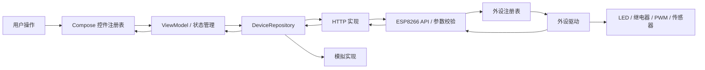

# WiFi 外设遥控系统设计

状态：规划方案，未实现。日期：2026-10-09。

## 1. 目标与边界

Android 手机是上位机遥控器；ESP8266 是提供 WiFi 服务、解析命令、驱动外设的下位机。首版完成至少一个二态外设的控制与状态同步。扩展目标包括多路继电器、PWM 调光和只读传感器，但不要求一次实现所有驱动。

首版不包含云端账户、互联网远程访问、视频、车辆控制、自动 WiFi 配网、后台常驻服务和 OTA。手动配置地址；模拟模式与真实模式都使用同一业务模型。

## 2. 方案比较与选择

| 方案 | 优点 | 成本/限制 | 定位 |
| --- | --- | --- | --- |
| HTTP + JSON 能力描述 | 易调试、无需额外服务、安卓与固件独立开发 | 状态更新首版依赖轮询 | 推荐首版 |
| 自定义 TCP 文本/二进制 | 开销小、可保持长连接 | 需自行定义分帧、连接恢复与协议调试工具 | 未来低延迟需求再评估 |
| MQTT | 适合多设备和发布订阅 | 要部署 broker、管理主题与连接 | 后续多节点扩展 |

WiFi 拓扑：首版优先 ESP8266 SoftAP，手机连接板端热点；后续支持 STA（手机与开发板处于同一局域网）。两种模式使用相同 API。`192.168.4.1:80` 仅为 SoftAP 配置建议，最终以固件启动日志为准；STA 不能假定同一地址。

ESP8266 支持 AP/STA 模式，见[官方 ESP8266WiFi 文档](https://arduino-esp8266.readthedocs.io/en/latest/esp8266wifi/readme.html)。首版不启用 AP+STA 的额外复杂性。

## 3. 分层与数据流



Android 不知道 GPIO 编号和有效电平；它只识别 `resourceId`、属性类型与约束。下位机负责地址路由、参数验证、驱动、安全默认状态与状态读取。

第一阶段保留单一 `:app`，按包隔离，不为了架构提前拆多个 Gradle 模块：

```text
edu.wifi.light/
  core/model/           设备、资源、属性、状态和错误
  core/protocol/        JSON DTO、版本检查、映射
  data/remote/          HTTP 客户端与 WiFi 网络路由
  data/mock/            模拟设备、故障注入
  data/preferences/     地址和刷新偏好
  domain/               DeviceRepository 接口与校验
  feature/connection/   连接表单与状态
  feature/control/      能力控件和命令状态
  feature/diagnostics/  有界日志
  ui/theme/             现有主题
```

ViewModel 使用 StateFlow 发布单向状态；网络调用放在可取消的协程中。通过简单依赖装配注入 Repository，首版无须引入完整 DI 框架。选用 OkHttp 与 Kotlin serialization，具体版本在实施时核对兼容性并固定到版本目录；不使用动态版本。

## 4. 安卓界面与行为

首页包含连接区、设备区、外设卡片区、诊断入口。

- 连接区：真实/模拟模式、主机、端口、连接/断开、最近成功时间；保存非敏感连接配置。
- 设备区：设备名称、固件版本、协议版本、连接状态；模拟模式持续显示明显标识。
- 外设卡片：名称、确认状态、待发送/等待响应/失败提示；开关控制可写 boolean，数值控制可写 integer/number，文本/读数显示只读属性。
- 诊断区：最近 100 条事件和重试入口；仅记录时间、resourceId、requestId、状态与错误，不记录网络密钥。

首版真实外设是 binary-output；模拟设备至少提供 binary-output、range-output、sensor，以证明 UI 不依赖固定数量的按钮。未知属性类型仅显示“不支持的属性类型”，不可写，不能导致整个设备页面崩溃。

发送时对该资源串行化写操作。用户点击开关后显示待确认目标，但“当前状态”仍保留最后一次设备回报。成功响应后提交状态；超时显示“结果未知”，重新读取状态，不把错误等同于物理关断。旋转屏幕不重复发送命令。

连接状态：Disconnected → Connecting → Connected；权限被拒绝进入 PermissionRequired；请求失败显示 Error/Recovering。恢复连通后先读设备信息、能力和状态，再启用写操作；不会自动重放断线期间的动作。

## 5. 上下位机扩展点

### Android

`DeviceRepository` 提供连接、获取描述、读取状态、设置属性、断开。DTO 与 UI 模型分离；控件注册表按属性类型选择控件，资源 ID 只用于寻址。

新增同类型 LED/继电器或 PWM 通道：只增加板端配置和能力描述，App 自动显示。新增设备类型但沿用已有属性类型：优先组合现有控件。新增全新的属性类型（如颜色、向量）：协议增加类型、安卓增加解析/渲染/验证、模拟端补样例；这需要双方支持，不能承诺零改动适配任意硬件。

首版同一时刻连接一台下位机，支持多个外设。未来多设备管理在 Repository 外增加会话管理；首版不将“多外设”误写成“多板端并发”。

### ESP8266

固件规划采用 Arduino ESP8266 Core；可选 PlatformIO 管理可重复构建，实施时先确认开发板类型再固定 board/core/library 版本。

```text
firmware/esp8266/（固件阶段才创建工程）
  src/network/         AP/STA 配置与连接管理
  src/api/             HTTP 路由、解析、错误映射
  src/resources/       固定容量资源注册表
  src/drivers/         BinaryOutput / PWM / Sensor
  include/             接口与板级配置
  test/                参数校验与驱动替身测试
```

驱动接口职责：描述属性、校验目标、设置状态、读取状态、进入安全状态。注册时绑定资源 ID、GPIO、有效电平和允许范围。驱动之间禁止重复占用引脚；能力描述必须由同一注册配置产生，避免“UI 声称可控但没有驱动”。

初版资源上限 8、请求体上限 1024 字节、响应体上限 16 KiB；固件实测堆占用后可调小。避免无界动态分配、无界日志和持续阻塞的驱动；传感器采样通过主循环调度，HTTP 路由读取缓存。PWM 限制由驱动描述，不把百分比与硬件计数值混用。

## 6. 网络与 Android 兼容性

Manifest 规划增加 `INTERNET`、`ACCESS_NETWORK_STATE`。targetSdk 已是 37：在 Android 17/API 37 真机上连接局域网前检查并申请 `ACCESS_LOCAL_NETWORK`，处理拒绝与撤回；低版本分支不调用不存在的权限 API。该规则依据[Android 局域网权限官方文档](https://developer.android.com/privacy-and-security/local-network-permission)，核对日期 2026-10-09。

首版用户手动在系统设置中连接热点，App 不扫描 SSID、不修改系统 WiFi，因此不因“使用 WiFi”就额外申请定位、扫描或配网权限。

热点可能无互联网，手机仍可能选择蜂窝网络。真实 HTTP 实现观察 WiFi 网络，在需要时通过对应 `Network.socketFactory` 发出请求；连接池按网络生命周期隔离，网络丢失时取消请求。不能将系统互联网验证失败当成板端离线，也不要求用户必须关闭移动数据。

局域网实验使用 HTTP。配置 Android 明文通信策略并覆盖最低 API 23；支持任意用户输入的局域网 IP 时，不能假定静态 XML 域名列表可以动态放行。实验构建可允许 HTTP，但 Repository 必须限制目标为用户确认的本地地址，禁用跨主机重定向；未来互联网部署改用 HTTPS 和认证。规则依据[Network Security Configuration](https://developer.android.com/privacy-and-security/security-config)。

## 7. 状态、生命周期与故障

前台控制页每 2 秒轮询一次完整状态；同一会话最多一条轮询在途，写操作期间跳过读取，写操作完成立即更新。进入后台暂停，恢复前台重新读状态。首版 3 秒连接超时、5 秒完整请求超时，允许在实测后调整。

GET 失败最多自动重试一次；控制请求不盲目重发。应用重启不自动执行保存的目标值。设备 reboot 后 bootId 改变，旧状态和请求结果失效。切换设备或模拟模式增加会话代号，旧会话迟到响应丢弃。

## 8. 实物策略与风险

开发板型号尚未知，GPIO/板载 LED 有效电平不能由 NodeMCU 标签推断为事实。先查对应原理图/板卡资料，确认 GPIO 与 Dx 对照、启动约束，再设置驱动配置。

首版以板载 LED 或低压 LED + 合适限流电阻验证；继电器使用匹配 3.3 V 控制接口的驱动模块和明确的供电/接地方案。GPIO 不直接驱动大电流负载。实验范围采用低压负载，不涉及市电接线。

二态“状态”默认是 MCU 已设置的逻辑输出，**不是触点或灯光实际工作反馈**。若需证明继电器触点状态，加入反馈输入/传感器资源，并分别显示命令状态与实测状态。

上电输出默认关闭，网络断开时首版保持当前输出（适用于灯光演示）；不自动还原保存值。电机等有风险外设另行定义断联停止和看门狗策略，不能直接套用灯光策略。

## 9. 设计验证

通过协议契约测试、模拟端故障注入、安卓真机网络检查和实际外设演示分别验证四个层面。具体任务见[实施计划](../plans/implementation-plan.md)，接口见[协议](../protocol/wifi-control-v1.md)，验收见[验收清单](../testing/acceptance.md)。
